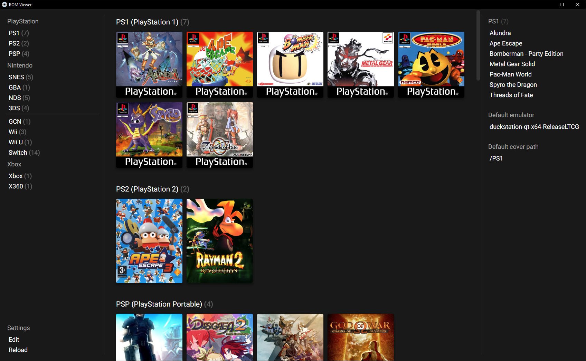

# ROM Viewer

Displays a list of ROMs, grouped by platform.



Comes in two versions:

### Web version

Pure HTML version.
Loads faster but does not have the capability to run roms on click.

[Web version readme](/web-version/README.md)

### Desktop version

Integrated with NeutralinoJS.
Loads slower but does have the capability to run roms on click.

[NeutralinoJS version readme](/src/README.md)

<br>

## Cover lookup

The app will look for covers matching the ROM's name. Text between parenthesis or brackets will be ignored.

_e.g.:_
Given ROM filename  
`"Foo [bar] (baz) {qux}.iso"`,  
a cover with filename  
`"Foo.jpg"`  
will be looked up.

<br>

## Config description

```
{
  "appConfig": {
    "coverFontSize": string, // font size for cover text (optional; defaults to 1.25em)
    "coverWidth": string, // cover width (optional; defaults to 192px)
    "maxColumns": string, // maximum number of rom columns to display (optional; defaults to 7)
    "minCoverHeight": string, // minimum cover height (optional; defaults to 136px)
    "showRomCount": boolean // show rom count next to each platform (optional; defaults to true)
  },
  "coverPath": string, // base cover path, should be an absolute path
  "emulatorPath": string, // base emulator path, should be an absolute path
  "romPath": string, // base rom path, should be an absolute path
  "platforms": Array<PlatformElement>
}
```

<br>

### PlatformElement

```
{
  "label": string, // platform name
  "coverPath": string, // path to the covers for this platform; relative to the root coverPath (optional; defaults to the platform's name)
  "emulatorPath": string, // path to the emulator for this platform; relative to the root emulatorPath
  "romPath": string, // path to the roms for this platform; relative to the root romPath (optional; defaults to the platform's name)
  "roms": Array<RomType>
}
```

or

```
{
  "label": string, // display a custom label
  "type": "label"
}
```

or

```
{
  "label": string, // display a separator
  "type": "separator"
}
```

<br>

### RomType

```
{
  "filename": string, // filename to be displayed; will be used for the cover lookup
  "path": string // paths to the rom, relative to the platform's romPath
}
```

or

```
string // paths to the rom, relative to the platform's romPath; will be used for the cover lookup
```

<br>

## TODO

- Find something to fill the right sidebar with
